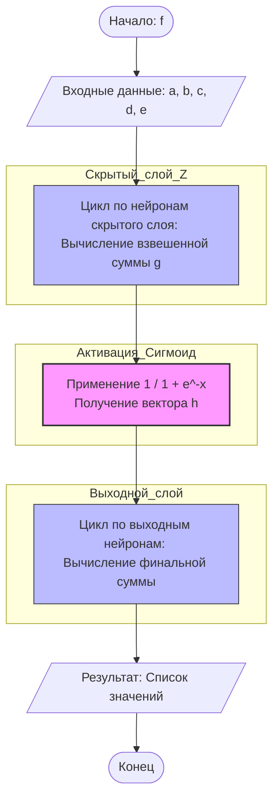

```mermaid
graph TD
    Start([Начало: f]) --> Input[/Входные данные: a, b, c, d, e/]
    
    subgraph Скрытый_слой_Z
        CalcZ[Цикл по нейронам скрытого слоя: <br/>Вычисление взвешенной суммы g]
    end
    
    Input --> CalcZ
    
    subgraph Активация_Сигмоид
        Sigmoid[Применение 1 / 1 + e^-x <br/>Получение вектора h]
    end
    
    CalcZ --> Sigmoid
    
    subgraph Выходной_слой
        CalcOut[Цикл по выходным нейронам: <br/>Вычисление финальной суммы]
    end
    
    Sigmoid --> CalcOut
    
    Result[/Результат: Список значений/]
    CalcOut --> Result
    Result --> End([Конец])

    style Sigmoid fill:#f9f,stroke:#333,stroke-width:2px
    style CalcZ fill:#bbf,stroke:#333
    style CalcOut fill:#bbf,stroke:#333
```